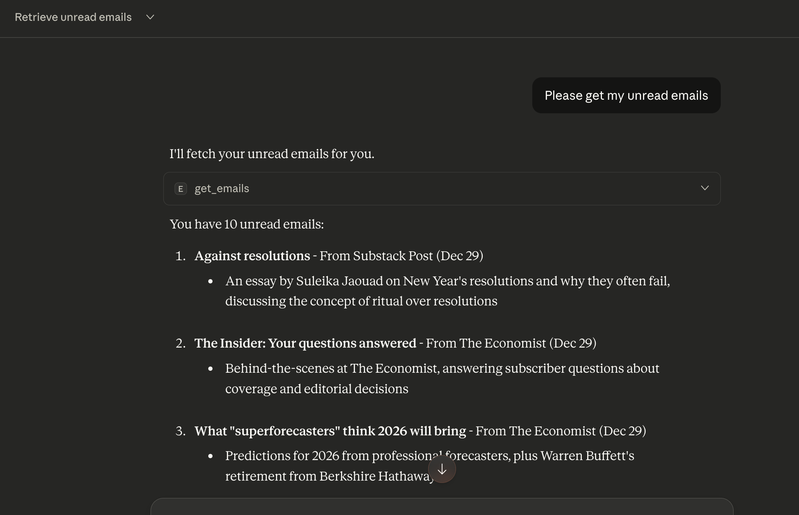
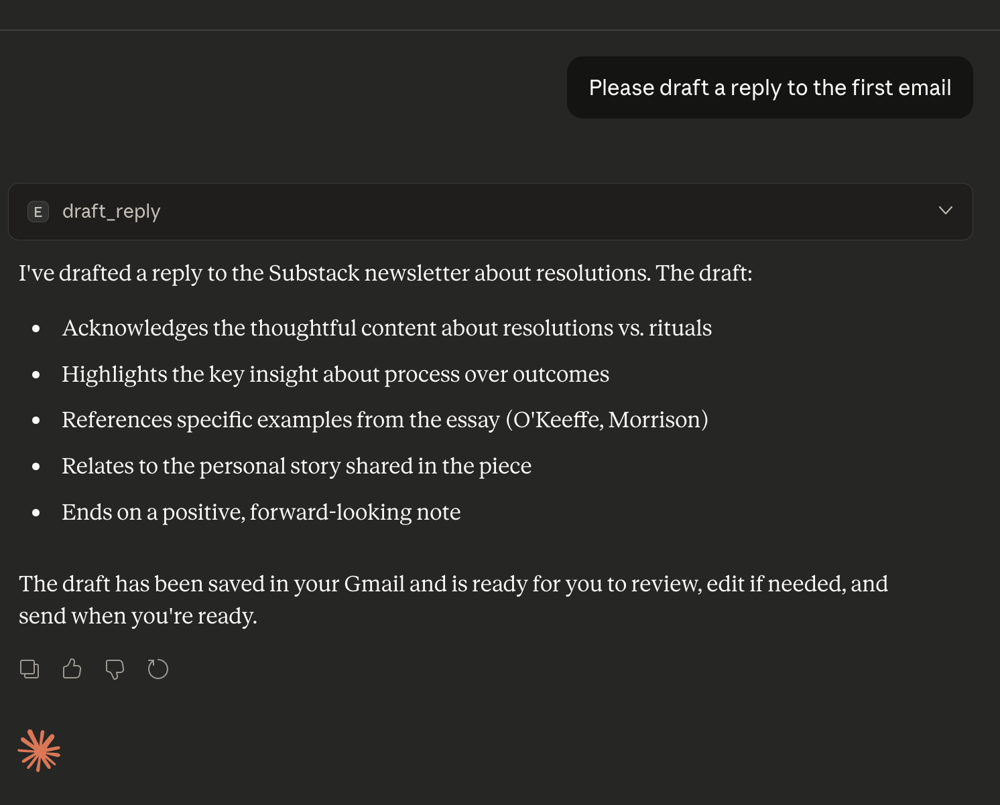

# Gmail MCP Server

A Model Context Protocol (MCP) server that provides access to Gmail functionality, allowing AI models to interact with emails through a standardized interface.

## Features

- List and read emails from your Gmail account
- Draft replies to emails
- Access a style guide from Google Docs
- OAuth2 authentication with Google's API
- Standardized MCP interface for AI model interaction

## Screenshots

### Viewing Emails

*Listing and viewing emails from your Gmail account*

### Drafting a Reply

*Drafting a reply to an email*

## Prerequisites

- Node.js (v14 or later)
- npm
- Google Cloud Project with Gmail API and Google Docs API enabled and correct scopes configured
- OAuth 2.0 Client ID credentials from Google Cloud Console

## Setup

1. **Clone the repository**
   ```bash
   git clone <repository-url>
   ```

2. **Install dependencies**
   ```bash
   npm install
   ```

3. **Set up Google Cloud Project**
   - Go to [Google Cloud Console](https://console.cloud.google.com/)
   - Create a new project or select an existing one
   - Enable the Gmail API and Google Docs API
   - Create OAuth 2.0 Client ID credentials with the following authorized redirect URIs:
     - `http://localhost:3000/oauth2callback`
    - Configure the following OAuth scopes:
       - `https://www.googleapis.com/auth/gmail.readonly`
       - `https://www.googleapis.com/auth/gmail.compose`
       - `https://www.googleapis.com/auth/documents.readonly`
   - Download the credentials JSON file and save it as `client_secret.json` in the project root

4. **Build the project**
   ```bash
   npm run build
   ```

## Authentication

Before using the server, you need to authenticate with your Google account:

```bash
npm run auth
```

This will:
1. Start a local server on port 3000
2. Open your default browser to the Google OAuth consent screen
3. After granting permissions, store the authentication tokens locally

## Running the Server

To start the MCP server:

```bash
npm start
```

The server will start and listen for MCP protocol messages on stdio.

## Available Commands

- `npm run build`: Build the TypeScript project
- `npm start`: Start the MCP server
- `npm run auth`: Set up Google OAuth authentication
- `npm run dev`: Start the server in development mode with auto-reload

## Available MCP Tools

The server provides the following MCP tools:

### get_unread_emails
Retrieves unread emails from your Gmail account.

**Parameters:**
- `maxResults` (number, optional): Maximum number of emails to return (default: 10)
- `unread` (boolean, optional): If true, only returns unread emails (default: true)

### create_draft_reply
Creates a draft reply to an email thread.

**Parameters:**
- `threadId` (string): The ID of the email thread to reply to
- `body` (string): The body content of the reply

## Environment Variables

The following environment variables can be set:

- `GOOGLE_APPLICATION_CREDENTIALS`: Path to the Google Cloud credentials file (if not using `client_secret.json` in the project root)
- `PORT`: Port for the OAuth callback server (default: 3000)
- `STYLE_GUIDE_DOCS_ID`: ID of the Google Doc containing the email style guide

## Security Notes

- The server stores OAuth tokens locally in a `tokens.json` file
- Never commit sensitive credentials to version control
- The server requires the following OAuth scopes:
  - `https://www.googleapis.com/auth/gmail.readonly`
  - `https://www.googleapis.com/auth/gmail.compose`
  - `https://www.googleapis.com/auth/documents.readonly`

